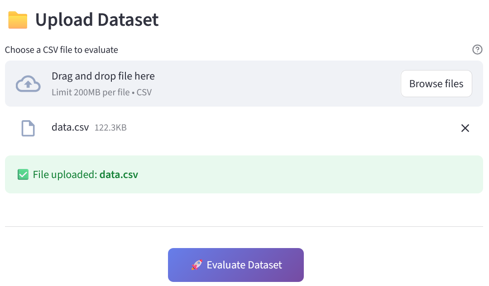
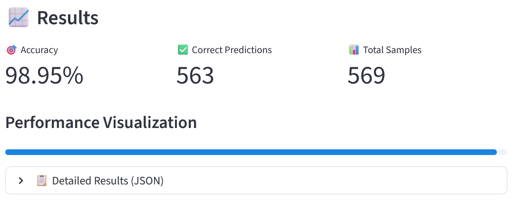

# Machine Learning Operations in Breast Cancer Aspirate Malignancy Classification

This is the project of group 5 in the course "Machine Learning Operations" at DTU.

# Project Description

### Overall goal of the project

The goals of this project are:
1. Create a machine learning model for binary classification for medical application - detect from tabular data, if an aspirate is malignant or not.
2. Create automated and reproducible ML pipeline to ensure fluid collaboration and adding of team members.

### Data
#### Dataset
The project is based on [Breast Cancer Wisconsin dataset](https://www.kaggle.com/datasets/uciml/breast-cancer-wisconsin-data/data) from Kaggle.
#### Number of samples
The dataset consists of 569 samples:
- 357 benign
- 212 malignant

#### Size
The dataset consists of a single csv file of 551 kB.
#### Modality
The data is **tabular data** with 30 features extracted from images of breast aspirates. The data is spread over 32 columns, of which first one is the id (irrelevant) and second one is the classification (B = benign, M = malignant).

The cell nucleus characteristics computed from images of fine needle aspirates (FNA) of breast tissue are:
- radius (mean of distances from center to points on the perimeter)
- texture (standard deviation of gray-scale values)
- perimeter
- area
- smoothness (local variation in radius lengths)
- compactness (perimeter^2 / area - 1.0)
- concavity (severity of concave portions of the contour)
- concave points (number of concave portions of the contour)
- symmetry
- fractal dimension ("coastline approximation" - 1)

The mean, standard error and "worst" or largest (mean of the three
largest values) of these features were computed for each image,
resulting in **30 features**.

### Models

Initially we will use a standard artificial neural network (ANN).

Similar model has been trained on the same dataset and has shown good performance [ANN Breast Cancer model by Ahmed Hafez](https://www.kaggle.com/code/ahmedtronic/ann-breast-cancer). We have also used some of the code of this submission, e.g. for data preprocessing step.

## Project structure

The project uses [Cookiecutter](https://github.com/cookiecutter/cookiecutter) and is based on [Machine Learning Operations template](https://github.com/SkafteNicki/mlops_template).
```txt
├── .dvc                      # Data Version Control
│   ├── cache
│   ├── tmp
│   ├── config
│   └── config.local
├── .github/                  # Github actions
│   └── workflows/
│       ├── evaluation.yaml
│       ├── linting.yaml
│       └── tests.yaml
├── .secrets/
│   └── gcp-key.json          # GCP service account key (to be added by user)
├── .venv/                    # Virtual environment (to be added by user)
├── configs/
├── data/                     # Data directory
│   ├── processed
│   └── raw
├── dockerfiles/              # Dockerfiles
│   ├── api.dockerfile
│   ├── api_requirements.txt
│   ├── dvc.dockerfile
│   ├── streamlit.dockerfile
│   └── streamlit_requirements.txt
├── models/                   # Trained models
├── outputs/
├── reports/                  # Reports
│   └── figures/
├── scripts/                  # Helper scritpt for testing
├── src/                      # Source code
│   ├── mlo_group_project/
│   │   ├──config/            # Configuration files
│   │   ├──styles/            # Streamlit styles
│   │   ├──training/          # Training scripts
│   │   ├── __init__.py
│   │   ├── api.py
│   │   ├── data.py
│   │   ├── evaluate.py
│   │   ├── guardrails.py
│   │   ├── model.py
│   │   ├── streamlit_app.py
│   │   ├── train.py
│   │   └── visualize.py
└── tests/                    # Tests
│   ├── __init__.py
│   ├── conftest.py
│   ├── sample_data.pt        # Sample data for tests (to be added automatically when tests are run)
│   ├── test_data.py
│   └── test_model.py
├── wandb/                    # Weights & Biases files
├── .dvcignore
├── .env                      # Environment variables (to be added by user)
├── .gcloudignore
├── .gitignore
├── .pre-commit-config.yaml
├── cloudbuild_api.yaml           # Google Cloud Build file
├── cloudbuild_stramlit_app.yaml  # Google Cloud Build file
├── docker-compose.yml            # Docker compose file
├── dvc.lock                      # DVC lock file
├── pyproject.toml            # Python project file
├── README.md                 # Project README
├── requirements.txt          # Project requirements
├── requirements_dev.txt      # Project development requirements
├── tasks.py                  # Project invoke tasks
└── uv.lock                   # uv lock file
```
## How to run
We use invoke as our primary project CLI to simplify complex commands and DVC to store data.

### Setup
1. Clone the repository:
    ```bash
   git clone https://github.com/kadijairus/mlo_project.git
   cd mlo_project
   ```
2. Install uv (optional, for running scripts):
   ```bash
   pip install uv
   ```
3. Get credentials for Wandb and Google Cloud service account key.
4. Save the Google Cloud service account key JSON file to `.secrets/gcp-key.json` in your project root.
4. Add to .env file (create if it doesn't exist):
   ```env
   WANDB_API_KEY=your_wandb_api_key_here
   GOOGLE_APPLICATION_CREDENTIALS="gcp-key.json"
   ```
4. Activate virtual environment:
   ```bash
   source .venv/bin/activate  # On Windows use `venv\Scripts\activate`
   ```
5. Install the required dependencies and ensure your environment is set up:
   ```bash
   uv sync
   ```

### Update data artifacts

We use DVC to version heavy artifacts and invoke for commands.
Use these commands to keep your local environment in sync with the cloud registry.

1. Before running any scripts, you must pull the data artifacts tracked by DVC:
   ```bash
   uv run invoke data-pull
   ```
2. After running a successful training and reaching a new "best" model upload data using:
   ```bash
   uv run invoke promote
   ```
3. Pushing data to DVC updates the local dvc.lock file. Commit this to git.

4. See other invoke tasks in `tasks.py` file or run:
   ```bash
   uv run invoke --list
   ```

### Running the standard pipeline

1. Run preprocess and training if data.py or train.py has changed.
   ```bash
   uv run invoke repro
   ```

2. Optional: preprocess and train can be run separately:
   ```bash
   uv run invoke preprocess-data
   uv run invoke train
   ```

3. Promote best model to cloud registry:
   ```bash
   uv run invoke promote
   ```

4. Run evaluation on the test set
   ```bash
   uv run invoke evaluate
   ```

5. Run all tests
   ```bash
   uv run invoke test
   ```

### Runnig via the Docker

All project tasks (data pulling, training, and evaluation) can be executed within a containerized environment to ensure consistency across different machines.

1. Setup.
Build the Docker image: Run this command from the project root to build the specialized DVC/worker image:

   ```bash
   docker build -f dockerfiles/dvc.dockerfile . -t dvc:latest
   ```
2. Ensure the prerequisites (GCP Credentials):
To interact with Google Cloud Storage (e.g., via DVC), you must provide a service account key:
* Download a GCP Service Account key with Storage Object Admin (or Viewer/Creator) permissions.
* Save the JSON file to `.secrets/gcp-key.json` in your project root.

3. Usage. You can run any invoke task (`uv run invoke <task>`) defined in the project by passing it to the docker run command.

#### Usage examples

**To explore the container environment (Interactive Shell):**
If you need to debug or run multiple commands manually, use the `--entrypoint` override:

   ```
   docker run --rm -it \
   -v $(pwd)/.secrets/gcp-key.json:/app/gcp-key.json:ro \
   -e GOOGLE_APPLICATION_CREDENTIALS=/app/gcp-key.json \
   --entrypoint sh \
   dvc:latest
   ```

**To run a specific task (e.g., pulling data):**

   ```
   docker run --rm -it \
   -v $(pwd)/.secrets/gcp-key.json:/app/gcp-key.json:ro \
   -e GOOGLE_APPLICATION_CREDENTIALS=/app/gcp-key.json \
   dvc:latest data-pull
   ```

### Monitoring and profiling

We use Hydra for configuration management.
We use WandB to monitor training.
Training progress and model artifacts are automatically logged to Weights & Biases dashboard.

1. Run training with performance profiling enabled:
   ```bash
   uv run invoke train-profile
   ```
2. Visualise results:
   ```bash
   snakeviz reports/train_profile.prof
   ```

### Inference API & User Interface to Evaluate the Model (Three Options)

This project features a **FastAPI backend** for programmatic model inference and a **Streamlit frontend** for
interactive spatial data evaluation.

#### API: Local Development (via Invoke)

The easiest way to run the services locally for development is using our `invoke` tasks.

>Prerequisites: Ensure that `models/best_model.pt` and the required preprocessing files (scalers, encoders) are present in the `data/processed/` directory before starting.

1. Start the backend API server:
   ```bash
   uv run invoke serve-api
   ```
2. Start the frontend UI server:
   ```bash
   uv run invoke serve-ui
   ```
3. Usage:
* Open your browser and navigate to http://localhost:8501.

* Under the "Upload dataset" section, select a .csv file containing your samples.

* Click "Evaluate Dataset" to generate predictions from the model.

#### API: Containerized Deployment (via Docker)
To ensure environment consistency and simplify dependency management, we provide a `docker-compose.yml` file to orchestrate both services in parallel.

1. Build and launch the containers:

   ```
   docker compose up --build
   ```

2. Accessing the services:

Frontend UI: Navigate to http://localhost:8501.

Backend API: Available at http://localhost:8000


#### API: Cloud Production (Google Cloud Platform)
The evaluation services are deployed on **Google Cloud Run**, providing a scalable and highly available production environment.
* Live User Interface: [streamlit-app-934984265576.europe-west1.run.app](https://streamlit-app-934984265576.europe-west1.run.app/)
> **MLOps Note**: The UI service is linked to the API through the API_URL environment variable. If redeploying the API, ensure the UI's environment variable is updated to point to the new service URL to maintain connectivity.

## App instructions
The application allows users to upload a dataset for model evaluation:



Once the dataset is uploaded, the application evaluates the model’s performance and displays the results:


