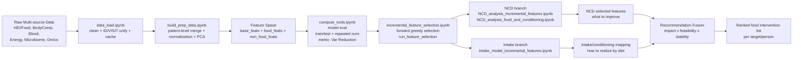

```mermaid
flowchart LR
  A[Raw Multi-source Data\nHEI/Food, BodyComp, Blood,\nEnergy, Microbiome, Omics] --> B[data_load.ipynb\nclean + ID/VISIT unify + cache]
  B --> C[build_prep_data.ipynb\npatient-level merge + normalization + PCA]
  C --> D[Feature Space\nbase_feats + food_feats + non_food_feats]

  D --> E[compute_tools.ipynb\nmodel eval\ntrain/test + repeated runs\nmetric: Var Reduction]
  E --> F[incremental_feature_selection.ipynb\nforward greedy selection\nrun_feature_selection]

  F --> G1[NCD branch\nNCD_analysis_incremental_features.ipynb\nNCD_analysis_food_and_conditioning.ipynb]
  F --> G2[Intake branch\nintake_model_incremantal_features.ipynb]

  G1 --> H1[NCD selected features\nwhat to improve]
  G2 --> H2[Intake/conditioning mapping\nhow to realize by diet]

  H1 --> I[Recommendation Fusion\nimpact x feasibility x stability]
  H2 --> I
  I --> J[Ranked food intervention list\nper target/person]

```