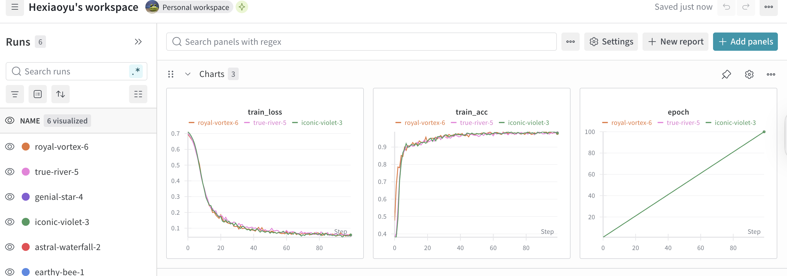
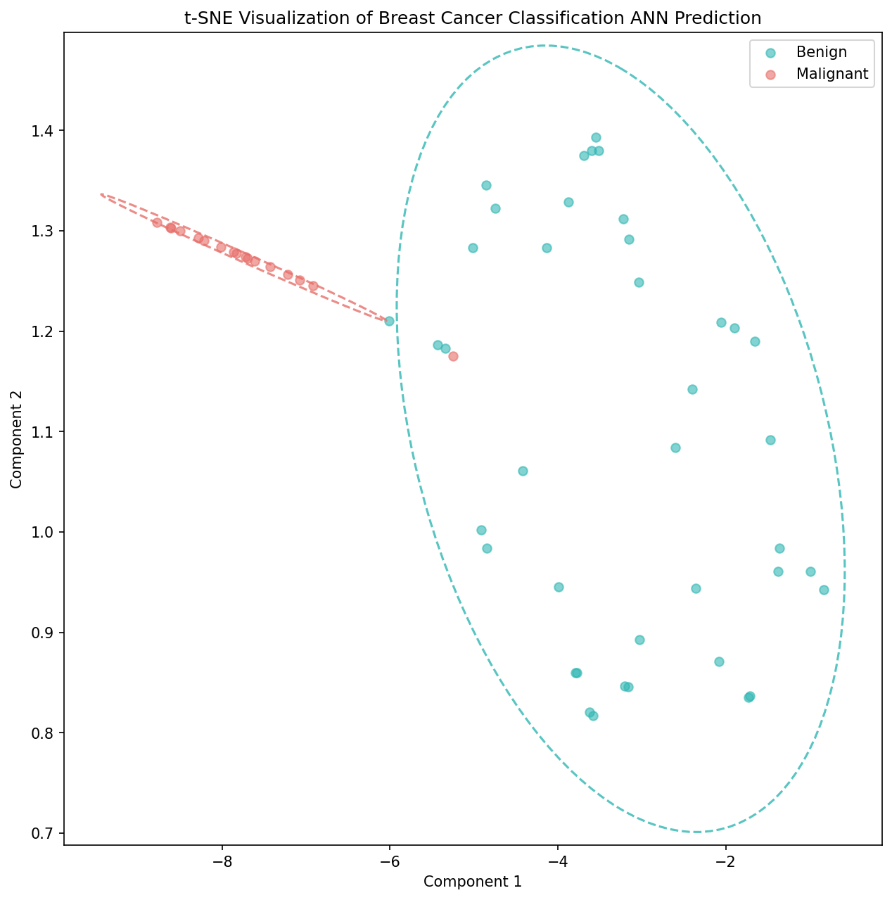
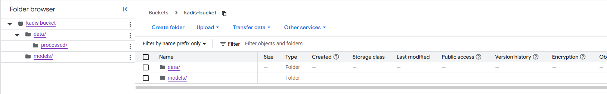
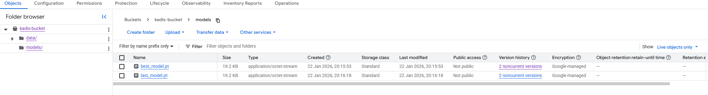
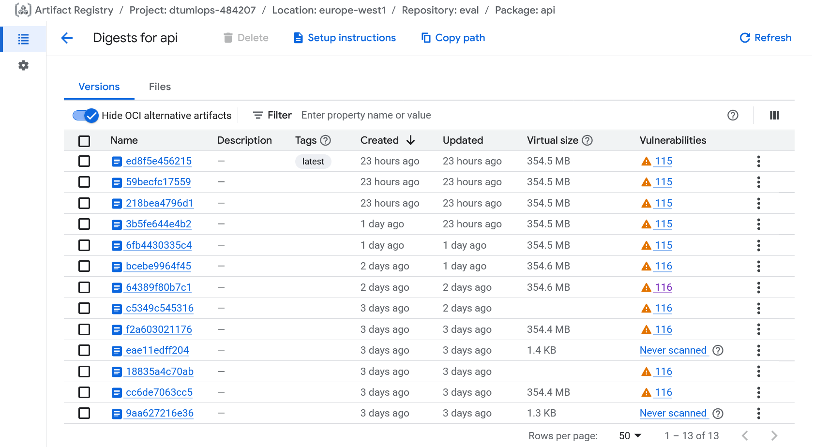
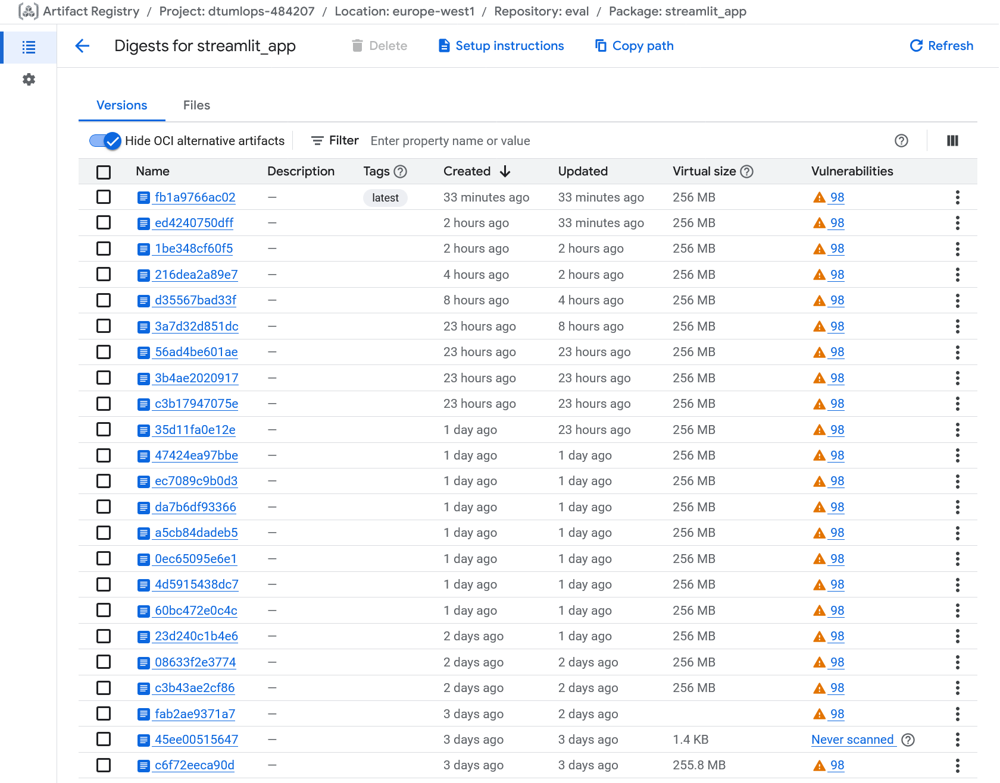
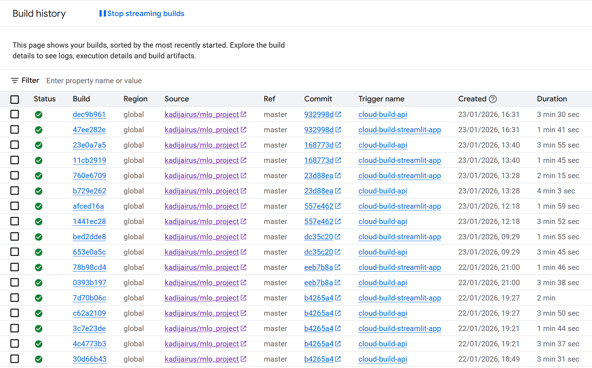
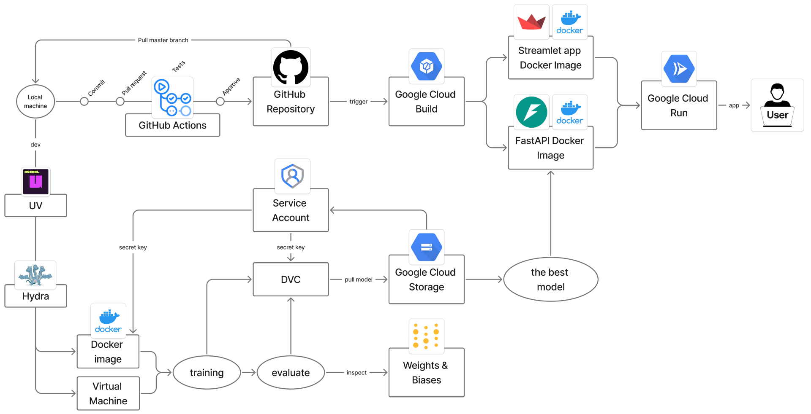

# Exam template for 02476 Machine Learning Operations

This is the report template for the exam. Please only remove the text formatted as with three dashes in front and behind
like:


```--- question 1 fill here ---```

Where you instead should add your answers. Any other changes may have unwanted consequences when your report is
auto-generated at the end of the course. For questions where you are asked to include images, start by adding the image
to the `figures` subfolder (please only use `.png`, `.jpg` or `.jpeg`) and then add the following code in your answer:

``

In addition to this markdown file, we also provide the `report.py` script that provides two utility functions:

Running:

```bash
python report.py html
```

Will generate a `.html` page of your report. After the deadline for answering this template, we will auto-scrape
everything in this `reports` folder and then use this utility to generate a `.html` page that will be your serve
as your final hand-in.

Running

```bash
python report.py check
```

Will check your answers in this template against the constraints listed for each question e.g. is your answer too
short, too long, or have you included an image when asked. For both functions to work you mustn't rename anything.
The script has two dependencies that can be installed with

```bash
pip install typer markdown
```

or

```bash
uv add typer markdown
```

## Overall project checklist

The checklist is *exhaustive* which means that it includes everything that you could do on the project included in the
curriculum in this course. Therefore, we do not expect at all that you have checked all boxes at the end of the project.
The parenthesis at the end indicates what module the bullet point is related to. Please be honest in your answers, we
will check the repositories and the code to verify your answers.

### Week 1

* [x] Create a git repository (M5)
* [x] Make sure that all team members have write access to the GitHub repository (M5)
* [x] Create a dedicated environment for you project to keep track of your packages (M2)
* [x] Create the initial file structure using cookiecutter with an appropriate template (M6)
* [x] Fill out the `data.py` file such that it downloads whatever data you need and preprocesses it (if necessary) (M6)
* [x] Add a model to `model.py` and a training procedure to `train.py` and get that running (M6)
* [x] Remember to fill out the `requirements.txt` and `requirements_dev.txt` file with whatever dependencies that you
    are using (M2+M6)
* [x] Remember to comply with good coding practices (`pep8`) while doing the project (M7)
* [x] Do a bit of code typing and remember to document essential parts of your code (M7)
* [x] Setup version control for your data or part of your data (M8)
* [x] Add command line interfaces and project commands to your code where it makes sense (M9)
* [x] Construct one or multiple docker files for your code (M10)
* [x] Build the docker files locally and make sure they work as intended (M10)
* [x] Write one or multiple configurations files for your experiments (M11)
* [x] Used Hydra to load the configurations and manage your hyperparameters (M11)
* [x] Use profiling to optimize your code (M12)
* [x] Use logging to log important events in your code (M14)
* [x] Use Weights & Biases to log training progress and other important metrics/artifacts in your code (M14)
* [ ] Consider running a hyperparameter optimization sweep (M14)
* [ ] Use PyTorch-lightning (if applicable) to reduce the amount of boilerplate in your code (M15)

### Week 2

* [x] Write unit tests related to the data part of your code (M16)
* [x] Write unit tests related to model construction and or model training (M16)
* [x] Calculate the code coverage (M16)
* [x] Get some continuous integration running on the GitHub repository (M17)
* [x] Add caching and multi-os/python/pytorch testing to your continuous integration (M17)
* [x] Add a linting step to your continuous integration (M17)
* [x] Add pre-commit hooks to your version control setup (M18)
* [x] Add a continues workflow that triggers when data changes (M19)
* [x] Add a continues workflow that triggers when changes to the model registry is made (M19)
* [x] Create a data storage in GCP Bucket for your data and link this with your data version control setup (M21)
* [x] Create a trigger workflow for automatically building your docker images (M21)
* [ ] Get your model training in GCP using either the Engine or Vertex AI (M21)
* [x] Create a FastAPI application that can do inference using your model (M22)
* [x] Deploy your model in GCP using either Functions or Run as the backend (M23)
* [x] Write API tests for your application and setup continues integration for these (M24)
* [ ] Load test your application (M24)
* [ ] Create a more specialized ML-deployment API using either ONNX or BentoML, or both (M25)
* [x] Create a frontend for your API (M26)

### Week 3

* [x] Check how robust your model is towards data drifting (M27)
* [ ] Setup collection of input-output data from your deployed application (M27)
* [ ] Deploy to the cloud a drift detection API (M27)
* [x] Instrument your API with a couple of system metrics (M28)
* [ ] Setup cloud monitoring of your instrumented application (M28)
* [x] Create one or more alert systems in GCP to alert you if your app is not behaving correctly (M28)
* [ ] If applicable, optimize the performance of your data loading using distributed data loading (M29)
* [ ] If applicable, optimize the performance of your training pipeline by using distributed training (M30)
* [ ] Play around with quantization, compilation and pruning for you trained models to increase inference speed (M31)

### Extra

* [x] Write some documentation for your application (M32)
* [ ] Publish the documentation to GitHub Pages (M32)
* [x] Revisit your initial project description. Did the project turn out as you wanted?
* [x] Create an architectural diagram over your MLOps pipeline
* [x] Make sure all group members have an understanding about all parts of the project
* [x] Uploaded all your code to GitHub

## Group information

### Question 1
> **Enter the group number you signed up on <learn.inside.dtu.dk>**
>
> Answer:

5

### Question 2
> **Enter the study number for each member in the group**
>
> Example:
>
> *sXXXXXX, sXXXXXX, sXXXXXX*
>
> Answer:

s256613, s204475, s256594, 260025, s240118
Kadi Jairus - s256613
Victor G. H. Rasmussen - s204475
Eduard Haiman - s256594
Xiaoyu He - 260025
Farnood Khordepaz -	s240118

### Question 3
> **Did you end up using any open-source frameworks/packages not covered in the course during your project? If so**
> **which did you use and how did they help you complete the project?**
>
> Recommended answer length: 0-200 words.
>
> Example:
> *We used the third-party framework ... in our project. We used functionality ... and functionality ... from the*
> *package to do ... and ... in our project*.
>
> Answer:

Currently, we are using no third-party framework that was not covered in the course. We focused on using tools
recommended and mastering the pipeline they support.

## Coding environment

> In the following section we are interested in learning more about you local development environment. This includes
> how you managed dependencies, the structure of your code and how you managed code quality.

### Question 4

> **Explain how you managed dependencies in your project? Explain the process a new team member would have to go**
> **through to get an exact copy of your environment.**
>
> Recommended answer length: 100-200 words
>
> Example:
> *We used ... for managing our dependencies. The list of dependencies was auto-generated using ... . To get a*
> *complete copy of our development environment, one would have to run the following commands*
>
> Answer:

We managed our dependencies using uv. The source of truth is the pyproject.toml file. To ensure every team member
has a bit-for-bit identical environment, we use a uv.lock file. A new team member can get an exact copy of the
environment by Git cloning and running ´uv sync´. Additionally, since our binary data and models are not stored in Git,
the member must run dvc pull after setting up their local service_account_key.json to fetch the processed tensors and
model checkpoints from Google Cloud Storage. This dual-layered approach (uv for code, DVC for data) ensures a fully
reproducible pipeline across different machines.

### Question 5

> **We expect that you initialized your project using the cookiecutter template. Explain the overall structure of your**
> **code. What did you fill out? Did you deviate from the template in some way?**
>
> Recommended answer length: 100-200 words
>
> Example:
> *From the cookiecutter template we have filled out the ... , ... and ... folder. We have removed the ... folder*
> *because we did not use any ... in our project. We have added an ... folder that contains ... for running our*
> *experiments.*
>
> Answer:

From the cookiecutter template we have filled out the tests, .github, data, dockerfiles, models, reports, wandb, configs
and src folder. We have removed the notebooks folder because we did not use any Jupyter notebooks in our project.
We have added:
(1) .dvc folder to manage our remote connection to Google Cloud Storage,
(2) scripts folder to hold helper-script to create smaller data files for testing,
(3) outputs folder for running our experiments,
(4) src/mlo_group_project/training folder to hold helper classes for training.py,
(5) src/mlo_group_project/config folder containing Hydra configuration files (config.yaml and hyperparameter configs), and
(6) gcp folder for Google Cloud Platform deployment artifacts.

### Question 6

> **Did you implement any rules for code quality and format? What about typing and documentation? Additionally,**
> **explain with your own words why these concepts matters in larger projects.**
>
> Recommended answer length: 100-200 words.
>
> Example:
> *We used ... for linting and ... for formatting. We also used ... for typing and ... for documentation. These*
> *concepts are important in larger projects because ... . For example, typing ...*
>
> Answer:

We used Ruff for both linting and formatting, enforcing PEP 8 compliance with a 120-character line length. For type
checking, we used mypy with strict settings enabled. We integrated pre-commit hooks to automatically run Ruff (fix,
format, and lint) on every commit, along with basic checks for trailing whitespace, YAML syntax, and large files.
These concepts are critical in larger projects because they ensure code consistency across team members, catch bugs
early (e.g., type errors before runtime), and make the codebase more maintainable and readable. For example, typing
helps prevent runtime errors by catching type mismatches during development, while consistent formatting reduces merge
conflicts and cognitive load when reviewing code. It is a good idea to centralise this, as we did, since having
individual setups for especially formatting will create conflicts more often than not.

## Version control

> In the following section we are interested in how version control was used in your project during development to
> corporate and increase the quality of your code.

### Question 7

> **How many tests did you implement and what are they testing in your code?**
>
> Recommended answer length: 50-100 words.
>
> Example:
> *In total we have implemented X tests. Primarily we are testing ... and ... as these the most critical parts of our*
> *application but also ... .*
>
> Answer:

In total we have implemented around 25 tests. Primarily, we focused on model robustness and data integrity. For model
tests we verified output shapes across variable batch sizes, ensured the model handles edge-case inputs (zeros, negative
numbers) without crashing or producing NaNs, and confirmed the model is deterministic in evaluation mode. And for the
we validated that processed tensors have the correct shape (30 features), are strictly normalized (MinMax scaling
between 0-1), and that there is no data leakage between training and test sets.

### Question 8

> **What is the total code coverage (in percentage) of your code? If your code had a code coverage of 100% (or close**
> **to), would you still trust it to be error free? Explain you reasoning.**
>
> Recommended answer length: 100-200 words.
>
> Example:
> *The total code coverage of code is X%, which includes all our source code. We are far from 100% coverage of our **
> *code and even if we were then...*
>
> Answer:

The total code coverage is currently 56% (tested by running `uv run invoke test`). Even if we achieved 100% code
coverage, we would not trust the system to be completely error-free. Code coverage only measures which lines of code
were executed during testing, not whether the logic or the results are correct. Still, it would be worthwhile to run
more code than not since it helps catch errors early. It is also important to test which files are actually generating
code coverage reports since all parts of the pipeline can be important to cover. Some parts, however, are more
high-risk and should be covered. Earlier parts of the pipeline remain the most critical, but ideally all parts should
be covered. Code coverage can also help highlight what code is actually used, however using packages such as
"cProfile" is better at isolating parts to optimise.

### Question 9

> **Did you workflow include using branches and pull requests? If yes, explain how. If not, explain how branches and**
> **pull request can help improve version control.**
>
> Recommended answer length: 100-200 words.
>
> Example:
> *We made use of both branches and PRs in our project. In our group, each member had an branch that they worked on in*
> *addition to the main branch. To merge code we ...*
>
> Answer:

We early on agreed to use both branches and pull requests. We even enforced rules so pushes cannot be made directly
on the main branch but only through pull requests (that also need a review). We did this in an attempt to ensure as
many people as possible are up to date with the project and try to keep unchecked code out of main. Still, this does
not ensure the code actually works, and it is up to the reviewer to be thorough and in the long run it is better to
ensure a continuous pipeline that performs automatic linting, building and testing (as we also do).

### Question 10

> **Did you use DVC for managing data in your project? If yes, then how did it improve your project to have version**
> **control of your data. If no, explain a case where it would be beneficial to have version control of your data.**
>
> Recommended answer length: 100-200 words.
>
> Example:
> *We did make use of DVC in the following way: ... . In the end it helped us in ... for controlling ... part of our*
> *pipeline*
>
> Answer:

We used DVC to track changes in our model and data (bcw.csv) by creating a pipeline in dvc.yaml. Using dvc repro
ensures that if either the preprocessing logic or the underlying data changes, the entire pipeline is consistently
updated and reproducible.
A second benefit of DVC is that it allows us to store large binary files, such as our PyTorch models, outside of Git.
We configured Google Cloud Storage as a remote, enabling team members to use dvc pull to sync the project state
seamlessly across different environments.
Finally, DVC served as a bridge to our automation; our GitHub Actions are configured to trigger an evaluation
workflow whenever dvc.lock is updated. This ensures that every new version of the data or model is automatically
validated before deployment, providing a reliable audit trail for our ML experiments.

### Question 11

> **Discuss you continuous integration setup. What kind of continuous integration are you running (unittesting,**
> **linting, etc.)? Do you test multiple operating systems, Python  version etc. Do you make use of caching? Feel free**
> **to insert a link to one of your GitHub actions workflow.**
>
> Recommended answer length: 200-300 words.
>
> Example:
> *We have organized our continuous integration into 3 separate files: one for doing ..., one for running ... testing*
> *and one for running ... . In particular for our ..., we used ... .An example of a triggered workflow can be seen*
> *here: <weblink>*
>
> Answer:

Our continuous integration (CI) pipeline is organized into four primary GitHub Action workflows, designed to ensure code reliability, style consistency, and model performance.

**1. Testing and Multi-Environment Validation**.
The `tests.yaml` workflow executes our suite of unit tests using `pytest`. To ensure cross-platform compatibility, we utilize a build matrix that runs tests across **Ubuntu, Windows, and macOS**. We leverage the `uv` package manager with the `--locked` flag for deterministic dependency installation. To optimize runner performance, we implemented **caching** via the `uv-setup` action, significantly reducing environment setup times.

**2. Linting and Static Analysis**.
The `linting.yaml` workflow is triggered on every push and pull request to the main branch. It enforces code quality using **Ruff** for fast linting and formatting, alongside **mypy** for static type checking. This ensures the codebase remains maintainable and reduces runtime errors.

**3. Automated Model Evaluation and DVC Integration**.
The `evaluation.yaml` workflow facilitates a seamless transition between data science and engineering. It is automatically triggered whenever `dvc.lock` is updated. This workflow authenticates with **Google Cloud Platform (GCP)**, pulls the latest model artifacts via **DVC**, and runs our evaluation suite to prevent performance regression before deployment.

**4. Continuous Deployment via Google Cloud Build**.
Finally, we automate our containerized deployment using **Google Cloud Build**. Two dedicated configuration files, `cloudbuild_api.yaml` and `cloudbuild_streamlit_app.yaml`, are triggered to rebuild and push Docker images for our API and Streamlit dashboard whenever the source code in `master` branch is updated.


## Running code and tracking experiments

> In the following section we are interested in learning more about the experimental setup for running your code and
> especially the reproducibility of your experiments.

### Question 12

> **How did you configure experiments? Did you make use of config files? Explain with coding examples of how you would**
> **run a experiment.**
>
> Recommended answer length: 50-100 words.
>
> Example:
> *We used a simple argparser, that worked in the following way: Python  my_script.py --lr 1e-3 --batch_size 25*
>
> Answer:

We use **Hydra** for hierarchical configuration, centralizing settings in `src/mlo_group_project/config/`. The `config.yaml` acts as the entry point, while `hp/basic.yaml` stores hyperparameters.

To run a standard experiment using our default configuration:

```bash
uv run python src/mlo_group_project/train.py

```

For more complex workflows, we use **Invoke** to wrap commands. You can view available tasks via:

```bash
uv run invoke --list

```

For custom runs, Hydra enables command-line overrides:

```bash
uv run python src/mlo_group_project/train.py hp.lr=0.01 hp.batch_size=128

```

Every execution automatically generates a unique, timestamped output directory (e.g., `outputs/2026-01-22/14-30-00/`), ensuring that logs, checkpoints, and the finalized configuration are preserved for every run.


### Question 13

> **Reproducibility of experiments are important. Related to the last question, how did you secure that no information**
> **is lost when running experiments and that your experiments are reproducible?**
>
> Recommended answer length: 100-200 words.
>
> Example:
> *We made use of config files. Whenever an experiment is run the following happens: ... . To reproduce an experiment*
> *one would have to do ...*
>
> Answer:

To ensure reproducibility and prevent information loss, we implemented a robust configuration management system using the **Hydra** framework. All experimental parameters are centralized in `src/mlo_group_project/config/`, where the main `config.yaml` defines essential project paths, including data, model, and report directories.

For experiment tracking, we utilized a modular approach by linking specific hyperparameter files (e.g., `hp/basic.yaml`) to the main configuration. We integrated Hydra into our workflow using the `@hydra.main` decorator in `train.py` and `evaluate.py`. To ensure compatibility between Hydra’s configuration management and **Typer’s** command-line interface, we wrapped our logic in dedicated functions such as `_evaluate()` and `evaluate_model()`.

Furthermore, to guarantee consistent results across different runs, we added a `seed` parameter to our hyperparameter configurations and enforced it globally using `torch.manual_seed()` within `model.py`. To reproduce any experiment, a user simply needs to run the training script with the corresponding hyperparameter config file, ensuring the exact same environment and stochastic initialization are maintained.

### Question 14

> **Upload 1 to 3 screenshots that show the experiments that you have done in W&B (or another experiment tracking**
> **service of your choice). This may include loss graphs, logged images, hyperparameter sweeps etc. You can take**
> **inspiration from [this figure](figures/wandb.png). Explain what metrics you are tracking and why they are**
> **important.**
>
> Recommended answer length: 200-300 words + 1 to 3 screenshots.
>
> Example:
> *As seen in the first image when have tracked ... and ... which both inform us about ... in our experiments.*
> *As seen in the second image we are also tracking ... and ...*
>
> Answer:



As seen in the first screenshot, we tracked training loss and accuracy over steps for our ANN model.These losses are key indicators of model convergence and generalization. A consistent decrease in both training and validation loss shows the model is learning effectively, while divergences can highlight overfitting or underfitting issues.



We also have had visualize, visualize1 and volcano plots, where the first two demostrate the performance of classification, and volcano plot is for visualizing selected features by our model. We show how decentralized and clustered data points are represented. These visual outputs complement quantitative metrics by helping us assess whether the model preserves both local and global data structures, ensuring that visualizations are meaningful and interpretable.

By tracking these parameters alongside performance metrics, we systematically identify configurations that optimize visualization quality while keeping computational costs reasonable. This approach ensures that improvements are data-driven and reproducible.

Together, these tracked metrics—loss curves and sample visualizations—give a holistic view of our experiments. Using Weights & Biases (W&B) allows us to monitor progress in real time, maintain version control, and easily compare results across model variants, supporting informed decisions for model refinement and reproducible research.

### Question 15

> **Docker is an important tool for creating containerized applications. Explain how you used docker in your**
> **experiments/project? Include how you would run your docker images and include a link to one of your docker files.**
>
> Recommended answer length: 100-200 words.
>
> Example:
> *For our project we developed several images: one for training, inference and deployment. For example to run the*
> *training docker image: `docker run trainer:latest lr=1e-3 batch_size=64`. Link to docker file: <weblink>*
>
> Answer:

For this project, we developed a containerized ecosystem using three specialized Docker images to handle the MLOps lifecycle from training to deployment.

**1. Training and Task Automation (`dvc.dockerfile`)**. The [dvc.dockerfile](../dockerfiles/dvc.dockerfile) provides a consistent environment for data preprocessing and training. It is designed to run **Invoke** tasks, ensuring that local development and containerized execution remain identical. To pull data securely from **GCP**, we mount a service account JSON key and pass it as an environment variable:

```bash
docker run --rm -it \
-v $(pwd)/.secrets/gcp-key.json:/app/gcp-key.json:ro \
-e GOOGLE_APPLICATION_CREDENTIALS=/app/gcp-key.json \
dvc:latest invoke data-pull

```

For debugging or manual execution of multiple steps, we use the `--entrypoint` override to access an interactive shell:

```bash
docker run --rm -it \
-v $(pwd)/.secrets/gcp-key.json:/app/gcp-key.json:ro \
-e GOOGLE_APPLICATION_CREDENTIALS=/app/gcp-key.json \
--entrypoint sh \
dvc:latest

```
**2. API and UI Deployment**
We separated the production services into [api.dockerfile](../dockerfiles/api.dockerfile) and [streamlit.dockerfile](../dockerfiles/streamlit_app.dockerfile). These are orchestrated using **Docker Compose**, which manages the shared network and port mapping:

```bash
docker compose up --build

```

This setup launches the **FastAPI backend** (port 8000) and **Streamlit UI** (port 8501) simultaneously. By using `invoke` inside Docker, we ensure that our complex project commands are executed reliably across any host system.

### Question 16

> **When running into bugs while trying to run your experiments, how did you perform debugging? Additionally, did you**
> **try to profile your code or do you think it is already perfect?**
>
> Recommended answer length: 100-200 words.
>
> Example:
> *Debugging method was dependent on group member. Some just used ... and others used ... . We did a single profiling*
> *run of our main code at some point that showed ...*
>
> Answer:

We introduced logging early in the project to help with debugging.
We used different levels of logging including debug, info, critical and success. By strategically placing log statements
throughout the codebase, we could trace the execution flow and identify where things went wrong. When a bug was
reported, we would first check the logs to see the sequence of events leading up to the error. This often provided
clues about the root cause.
More complicated bugs were solved with group: we discussed the problems in chat or in Zoom. Ofter the other team-member
opened the same branch and commited some fixes directly. This way we could share knowledge and help each other.
We introduced pre-commit hooks to automatically run linting and basic tests before every commit, catching potential
issues early in the development process.
Regarding profiling, we did run a profiling session using cProfile to identify performance bottlenecks.

## Working in the cloud

> In the following section we would like to know more about your experience when developing in the cloud.

### Question 17

> **List all the GCP services that you made use of in your project and shortly explain what each service does?**
>
> Recommended answer length: 50-200 words.
>
> Example:
> *We used the following two services: Engine and Bucket. Engine is used for... and Bucket is used for...*
>
> Answer:

We utilized a suite of **Google Cloud Platform (GCP)** services to create a fully integrated, serverless MLOps pipeline:

**1. Cloud Storage (GCS):** Acts as our remote storage for **DVC**. It hosts our large datasets and model binaries, enabling version control of data without increasing the Git repository size.

**2. Artifact Registry:** Serves as our private Docker registry. It stores and manages the versioned container images for our training environment, API, and Streamlit application.

**3. Cloud Build:** Integrated with GitHub, it automatically triggers whenever the master branch is updated, building new Docker images and pushing them to the Artifact Registry based on our `cloudbuild.yaml` configurations.

**4. Cloud Run:** A serverless platform used to host our **FastAPI backend** and **Streamlit frontend**. It provides automatic scaling and ensures our services are highly available via public URLs.

**5. Google Service Accounts:** The foundational security layer. We used dedicated service accounts with **IAM roles** (e.g., Storage Object Admin) to allow our Docker containers and GitHub Actions to authenticate securely with GCP resources.


### Question 18

> **The backbone of GCP is the Compute engine. Explained how you made use of this service and what type of VMs**
> **you used?**
>
> Recommended answer length: 100-200 words.
>
> Example:
> *We used the compute engine to run our ... . We used instances with the following hardware: ... and we started the*
> *using a custom container: ...*
>
> Answer:

While Compute Engine is the foundational infrastructure for GCP, we opted to use **Google Cloud Run** for our deployment. This serverless approach was chosen because our model is lightweight and does not require the heavy overhead or manual management of dedicated virtual machines.

By using Cloud Run, we benefit from automatic scaling and a pay-as-you-go model, which is more cost-effective for our API and Streamlit UI. These services are integrated via **Cloud Build**, which automates the deployment of our containerized code directly from GitHub.

For our specific project requirements:

* **API/UI:** Hosted on Cloud Run to avoid managing OS-level patches or VM scaling.
* **Training:** Conducted locally, as the model's computational requirements did not justify the use of specialized Compute Engine instances or GPUs.

Our live user interface is accessible here: [Streamlit App on Cloud Run](https://streamlit-app-934984265576.europe-west1.run.app/). The frontend communicates with the backend via an `API_URL` environment variable, ensuring that the two services remain decoupled yet connected.

### Question 19

> **Insert 1-2 images of your GCP bucket, such that we can see what data you have stored in it.**
> **You can take inspiration from [this figure](figures/bucket.png).**
>
> Answer:





### Question 20

> **Upload 1-2 images of your GCP artifact registry, such that we can see the different docker images that you have**
> **stored. You can take inspiration from [this figure](figures/registry.png).**
>
> Answer:





### Question 21

> **Upload 1-2 images of your GCP cloud build history, so we can see the history of the images that have been build in**
> **your project. You can take inspiration from [this figure](figures/build.png).**
>
> Answer:



### Question 22

> **Did you manage to train your model in the cloud using either the Engine or Vertex AI? If yes, explain how you did**
> **it. If not, describe why.**
>
> Recommended answer length: 100-200 words.
>
> Example:
> *We managed to train our model in the cloud using the Engine. We did this by ... . The reason we choose the Engine*
> *was because ...*
>
> Answer:

We chose not to use the cloud for training, as our model is very simple. Our classification model is a
straightforward feedforward neural network with only a few hidden layers processing 30 input features. The entire dataset contains only 569 samples, which after preprocessing results in small tensors easily handled on a local machine. Training runs complete in minutes on a standard laptop CPU (local experiments leave timestamps).
Given these constraints, the overhead of setting up VM instances, configuring cloud storage access, and managing remote
training jobs would have been counterproductive. We achieved our goal of experiment tracking through Weights & Biases,
which logged all metrics regardless of training location. The cost-benefit analysis clearly favored local development:
we could iterate faster, debug more easily, and avoid spending GCP credits on compute resources that provided no
practical advantage for our lightweight model architecture. Of course, getting the practical experience of implenting cloud training would still have been beneficial.

## Deployment

### Question 23

> **Did you manage to write an API for your model? If yes, explain how you did it and if you did anything special. If**
> **not, explain how you would do it.**
>
> Recommended answer length: 100-200 words.
>
> Example:
> *We did manage to write an API for our model. We used FastAPI to do this. We did this by ... . We also added ...*
> *to the API to make it more ...*
>
> Answer:

We used FastAPI to create a RESTful API for our project. The endpoint accepts POST requests with input data
and returns data evaluation in JSON format. The endpoint can be used using curl, but it is also accessible at:
https://streamlit-app-934984265576.europe-west1.run.app/
We included automatic API documentation using FastAPI's built-in Swagger UI, allowing users to easily explore and test
the endpoint. The API was containerized using Docker, ensuring consistent deployment across different environments.
We also implemented Google Cloud Build to automate the building and testing of our Docker images whenever we pushed
changes to our repository. This CI/CD pipeline ensured that our API was always up-to-date and reliable.

### Question 24

> **Did you manage to deploy your API, either in locally or cloud? If not, describe why. If yes, describe how and**
> **preferably how you invoke your deployed service?**
>
> Recommended answer length: 100-200 words.
>
> Example:
> *For deployment we wrapped our model into application using ... . We first tried locally serving the model, which*
> *worked. Afterwards we deployed it in the cloud, using ... . To invoke the service an user would call*
> *`curl -X POST -F "file=@file.json"<weburl>`*
>
> Answer:

We did manage to deploy our API using Google Cloud Run both locally and in the cloud.
First we served the API locally and tested it using curl.
Then we added added frontend using Streamlit, which enabled users to interact through a web interface.
Later we containerized our FastAPI application with Docker. We created two distinct cloudbuild.yaml files:
one for the API and one for the Streamlit application. These files instruct Google Cloud Build to build the Docker
image, push it to Google Artifact Registry, and then deploy it as a service on Cloud Run.
To invoke the deployed service, users can use browser to access the Streamlit frontend or use curl commands to send
POST requests. The production URL is provided by Cloud Run and is accessible at:
https://streamlit-app-934984265576.europe-west1.run.app/

### Question 25

> **Did you perform any unit testing and load testing of your API? If yes, explain how you did it and what results for**
> **the load testing did you get. If not, explain how you would do it.**
>
> Recommended answer length: 100-200 words.
>
> Example:
> *For unit testing we used ... and for load testing we used ... . The results of the load testing showed that ...*
> *before the service crashed.*
>
> Answer:

For unit testing, we used pytest to verify the individual components of our inference pipeline. We focused on three key areas: Model Logic: We verified that the model accepts variable batch sizes and produces valid probability outputs (strictly between 0 and 1). Input Guardrails: We tested our DataGuard class to ensure it correctly rejects "bad" inputs—such as NaNs, infinite values, or statistical outliers—before they are passed to the model. Data Integrity: We validated that our normalization logic maintains the expected feature ranges to prevent silent data corruption. We have not performed load testing yet, as the API is currently being integrated into the Google Cloud environment.How we would do load testing: To load test the API, we would use Locust, a Python-based load testing tool. We would write a locustfile.py script that simulates hundreds of concurrent users sending random tensor data to the /predict endpoint. We would gradually ramp up the number of users (e.g., from 10 to 1,000) and monitor two key metrics to find the breaking point: Latency: The point where average response time exceeds an acceptable threshold (e.g., 200ms). Failure Rate: The point where the server begins returning 500 errors or crashes due to Out-Of-Memory (OOM) exceptions.

### Question 26

> **Did you manage to implement monitoring of your deployed model? If yes, explain how it works. If not, explain how**
> **monitoring would help the longevity of your application.**
>
> Recommended answer length: 100-200 words.
>
> Example:
> *We did not manage to implement monitoring. We would like to have monitoring implemented such that over time we could*
> *measure ... and ... that would inform us about this ... behaviour of our application.*
>
> Answer:

Yes, we successfully implemented a real-time monitoring and alerting system integrated directly into our inference pipeline. The system works by using a custom DataGuard component that intercepts every request sent to the API before it reaches the model. This component monitors input statistics to detect data drift, outliers, or invalid values (like NaNs) instantly.

When an anomaly is detected, the system triggers a dual-logging strategy: it logs structured errors to Google Cloud Logging (for infrastructure-level alerts) and sends notifications to Weights & Biases (for model-specific tracking). This monitoring setup ensures the longevity of the application by giving us immediate visibility into how production data is behaving. If the logs show a spike in rejected inputs or drift warnings, we know exactly when the model is becoming stale and needs to be retrained.

## Overall discussion of project

> In the following section we would like you to think about the general structure of your project.

### Question 27

> **How many credits did you end up using during the project and what service was most expensive? In general what do**
> **you think about working in the cloud?**
>
> Recommended answer length: 100-200 words.
>
> Example:
> *Group member 1 used ..., Group member 2 used ..., in total ... credits was spend during development. The service*
> *costing the most was ... due to ... . Working in the cloud was ...*
>
> Answer:

We used 7.78 GCP credits during the project. The most expensive service was Container Registry Vulnerability Scanning,
which cost $4.16 because every new Docker image push cost. The second expencive service was Cloud Run, which cost
$3.39 due to frequent testing of the API.
The private projects cost less than $0.50.
Working in the cloud took a lot of time to set up, especially with permissions and access for all team members.
However, once set up, it provided a scalable and flexible environment for deploying our application.
It was good to get some free credits and test the environment. In the future we are able to use our personal
1000 credits a more experienced manner.

### Question 28

> **Did you implement anything extra in your project that is not covered by other questions? Maybe you implemented**
> **a frontend for your API, use extra version control features, a drift detection service, a kubernetes cluster etc.**
> **If yes, explain what you did and why.**
>
> Recommended answer length: 0-200 words.
>
> Example:
> *We implemented a frontend for our API. We did this because we wanted to show the user ... . The frontend was*
> *implemented using ...*
>
> Answer:

We implemented a simple frontend for our API using Streamlit. We did this because it allows non-technical users
to interact with the model and visualize predictions in real-time without needing to use terminal commands or raw
HTTP requests.
We also experiemented much more with visualisation than the report checkboxes suggest, since we find this one of the most important parts of making sure things are running as they should. Data and results are much easier to understand if properly visualised. Just seeing a high accuracy does not neccesarily mean it is a good model or is doing what we wanted it to do. 

### Question 29

> **Include a figure that describes the overall architecture of your system and what services that you make use of.**
> **You can take inspiration from [this figure](figures/overview.png). Additionally, in your own words, explain the**
> **overall steps in figure.**
>
> Recommended answer length: 200-400 words
>
> Example:
>
> *The starting point of the diagram is our local setup, where we integrated ... and ... and ... into our code.*
> *Whenever we commit code and push to GitHub, it auto triggers ... and ... . From there the diagram shows ...*
>
> Answer:



Our system architecture integrates local development, automated CI/CD pipelines, and cloud-native deployment.

**Local Development and Training**
The process originates on a **local machine**, where **uv** serves as the primary package and project manager. We utilize **Hydra** for hierarchical configuration management, enabling flexible experimentation. **Training** and **evaluation** are either containerized using **Docker** or executed within a **Virtual Machine** to ensure environment parity. During these phases, the system leverages **DVC** for data and model versioning. A **Google Service Account** provides the necessary credentials (secret keys) allowing DVC to securely pull datasets from or push models to **Google Cloud Storage**. Additionally, we integrate **Weights & Biases** to inspect and track real-time experiment metrics.

**CI/CD Pipeline**
Code changes are pushed to a **GitHub Repository**. When a pull request is created, it triggers **GitHub Actions** to execute automated unit tests and code quality checks. Once the code is approved and merged into the master branch, a **Google Cloud Build** trigger is activated to automate the transition from source code to production artifacts.

**Cloud Deployment**
**Google Cloud Build** handles the construction of production-ready **Docker images** for both the **FastAPI** backend and the **Streamlit** frontend. These images are stored in the registry and deployed to **Google Cloud Run**. This serverless platform hosts the final application, which dynamically pulls "the best model" from **Google Cloud Storage** to serve evaluations to the end **User**. This architecture ensures that every component—from data versioning to frontend hosting—is automated, scalable, and reproducible.

### Question 30

> **Discuss the overall struggles of the project. Where did you spend most time and what did you do to overcome these**
> **challenges?**
>
> Recommended answer length: 200-400 words.
>
> Example:
> *The biggest challenges in the project was using ... tool to do ... . The reason for this was ...*
>
> Answer:
>

The biggest challenges in the project were related to Google Cloud. Setting up GCP services and assuring that all
team members had the correct permissions and access took considerable time. The amount of different Roles was
overwhelming. We overcame these challenges by sharing our experiences of the setup process among team members.
We also had problems with DVC using Bucket. The time to delete files were set too short initially (7 days) and we lost the live versions, which caused confusion.
In general our team-work functioned well. We held regular meetings to discuss progress, challenges, and next steps.
It was sometimes difficult to coordinate schedules among all team members and discuss the project
during live Zoom meetings. This was not surprising, as we were a 100% online team. The use of asynchronous communication
channels like Slack helped us overcome this.
We also faced challenges in selecting which tasks to prioritize within the limited timeframe of the project. We
addressed this by allowing each team member to focus on areas aligned with their  interests, while ensuring that
everyone had a basic understanding of all parts of the project. It helped that we had group members with different
backgrounds and strengths.
We had different backgrounds in using Git and one team-member had a lot of merge conflicts. We were able to get to the roots of the problems, but lost a lot of time.

### Question 31

> **State the individual contributions of each team member. This is required information from DTU, because we need to**
> **make sure all members contributed actively to the project. Additionally, state if/how you have used generative AI**
> **tools in your project.**
>
> Recommended answer length: 50-300 words.
>
> Example:
> *Student sXXXXXX was in charge of developing of setting up the initial cookie cutter project and developing of the*
> *docker containers for training our applications.*
> *Student sXXXXXX was in charge of training our models in the cloud and deploying them afterwards.*
> *All members contributed to code by...*
> *We have used ChatGPT to help debug our code. Additionally, we used GitHub Copilot to help write some of our code.*
> Answer:

Student s256613 (Kadi Jairus) was responsible for:
- Setting things up: getting the group together, deciding scope/dataset, creating the initial repository with cookiecutter project structure, filling initial README, 
- Creating Google Cloud project and resolving access issues
- Managing the DVC integration with Google Cloud Storage 
- Coordinating team meetings and dividing tasks 
- improving tests with student s240118
- Merging at least half of the merge requests and helping with merge conflicts

Student s204475 (Victor G. H. Rasmussen) worked on:
- Adding the API and a Streamlit-based frontend for CSV upload and results display
- Runnable tasks (e.g., uv run invoke preprocess-data/train/evaluate/visualize/serve-api/serve-ui)
- Adding profilling tools (snakeviz) and using it to isolate related performance tweaks
- Good project hygiene (refactored training code (split train.py into helper modules))
- Improving data.py to persist scaler/feature metadata so inference works on new datasets
- Added/maintaining linting and test automation (GitHub Actions)

Student s240118 (Farnood Khordepaz):
- I focused on the Core Training Pipeline, Model Reliability, and Quality Assurance.
- Training & Evaluation Pipeline: I implemented the core training loop (train.py) and evaluation logic (evaluate.py). This included defining the optimization steps, loss calculation, and ensuring the   model correctly processes batches during both training and validation phases.
- Guardrails & Drift Detection (M27): I designed and implemented the guardrails.py module. This system acts as a runtime "bouncer" that validates input tensors against statistical thresholds, preventing the model from hallucinating on outliers, NaNs, or drifted data.
- Automated Alerting (M28): I integrated the guardrails with the Weights & Biases alerting system. This ensures that any "bad" data detected in production immediately triggers a real-time cloud alert to the team.
- Testing Infrastructure: I took ownership of the testing framework. This involved resolving critical dependency conflicts in pyproject.toml to get the CI environment running on macOS, implementing unit tests for the Model and Data modules, and mocking the training loop to verify integration without incurring compute costs.

Student s256594 (Eduard Haiman):
- Developed a hierarchical Hydra configuration system to standardize experiments across training and evaluation workflows.
- Engineered the project's Docker ecosystem, creating specialized images for DVC, FastAPI, and Streamlit, and orchestrated services using Docker Compose.
- Architected the GCP integration, implementing secure Service Account authentication for Cloud Storage access within containers.
- Configured Google Cloud Build to automate the build-to-registry pipeline for production images upon GitHub repository updates.
- Managed the deployment of the API and frontend UI on Google Cloud Run, configuring cross-service communication via environment variables.

Student s260025 (Xiaoyu He):
- I implemented the visualization module, using Visualize.py as the main method and additionally implementing visualize1 for decentralized data settings based on prior work and  volcano plot for feature selection. 
- I have spent significant time debugging the experimental pipeline and integrating DVC, Docker, and Weights & Biases to ensure reproducible experimentation, probably my debug experience can be used to guild others.


All members contributed to documentation.
Generative AI Usage: we used Generative AI (Google Gemini) primarily as a technical unblocker and pair programmer. It was essential for debugging complex environment errors (specifically between uv, torch, and hardware architectures) and for generating the initial boilerplate code for the unit tests and guardrail logic, allowing to focus on the system architecture rather than syntax.
